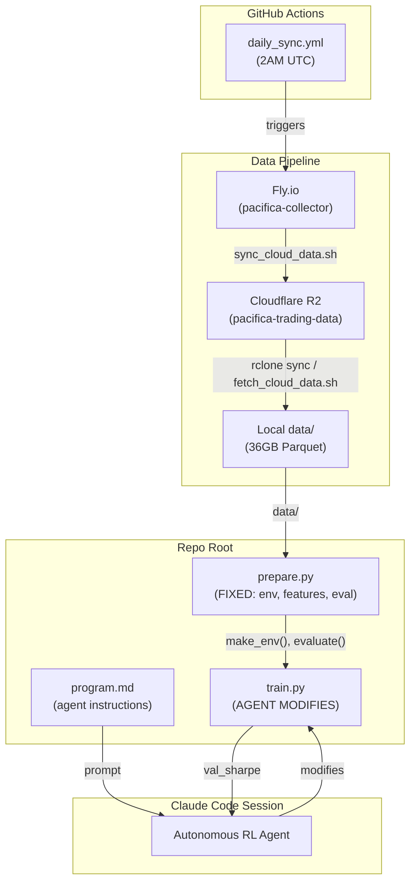

# Codebase Map

> Auto-generated by Cartographer. Last mapped: 2026-03-10

## System Overview



## Directory Structure

```
autoresearch-trading/              # repo root
├── .github/workflows/
│   └── daily_sync.yml             # Fly.io → R2 daily at 2AM UTC
├── .cache/                        # cached .npz feature files (gitignored)
├── .claude/
│   └── settings.local.json        # pre-approved commands for autonomous loop
├── data/                          # 36GB Hive-partitioned Parquet (gitignored)
│   ├── trades/symbol={SYM}/date={DATE}/*.parquet
│   ├── orderbook/symbol={SYM}/date={DATE}/*.parquet
│   └── funding/symbol={SYM}/date={DATE}/*.parquet
├── docs/
│   ├── plans/                     # design docs and implementation plans
│   └── superpowers/plans/         # detailed TDD implementation plans
├── scripts/
│   ├── sync_cloud_data.sh         # Fly.io → R2 via streaming tar + aws s3 sync
│   └── fetch_cloud_data.sh        # R2 → local via aws s3 sync
├── .python-version                # 3.12
├── pyproject.toml                 # torch, gymnasium, numpy, pandas, pyarrow
├── prepare.py                     # FIXED: data loading, features, TradingEnv, evaluate()
├── train.py                       # MUTABLE: agent rewrites this each experiment
├── program.md                     # agent instructions (Karpathy autoresearch pattern)
├── CLAUDE.md                      # repo-level Claude Code instructions
├── README.md                      # project overview
└── .gitignore                     # excludes data/, .cache/, .env, logs
```

## Module Guide

### Core (RL Research Loop)

**Purpose**: Autonomous RL research for DEX perpetual futures trading
**Entry point**: `uv run train.py`

| File | Purpose | Tokens |
|------|---------|--------|
| `prepare.py` | Data pipeline, 33-feature engineering, TradingEnv, evaluate() | ~6,500 |
| `train.py` | CleanRL-style PPO agent (agent modifies this) | 1,776 |
| `program.md` | Autonomous agent instructions and 12 research hints | 3,066 |
| `pyproject.toml` | Dependencies: torch, gymnasium, numpy, pandas, pyarrow | 100 |

**Key exports from prepare.py:**
- `make_env(symbol, split, window_size, trade_batch)` — creates TradingEnv
- `evaluate(env, policy_fn)` — runs policy, returns Sharpe ratio
- `prepare_data(symbols)` — pre-caches features for all symbols/splits
- `TradingEnv` — Gymnasium env, 3 actions (flat/long/short), 33 features
- `DEFAULT_SYMBOLS` — all 25 crypto symbols
- `TRAIN_BUDGET_SECONDS = 300`
- Date constants: `TRAIN_START`, `TRAIN_END`, `VAL_END`, `TEST_END`

**Feature vector (33 features per step, each step = 100 trades):**
- [0-13] Trade: VWAP, log_return, net_volume, trade_count, buy_ratio, CVD_delta, TFI, large_trade_count, VPIN, liq_cascade_mag, liq_cascade_dir, realvol_short, realvol_med, realvol_long
- [14-30] Orderbook: bid_depth, ask_depth, imbalance, spread_bps, 5× bid vols, 5× ask vols, microprice, microprice_dev, OFI
- [31-32] Funding: rate, rate_change

**Key exports from train.py (baseline):**
- `compute_reward(info, reward_state)` — pnl - vol_penalty - dd_penalty
- `PolicyNetwork(obs_shape)` — MLP(1650→128→128→3+1) with actor/critic heads
- `train()` — PPO training loop + evaluation, outputs greppable metrics

### scripts/ (Data Sync)

**Purpose**: Move data between Fly.io, Cloudflare R2, and local disk

| File | Purpose | Tokens |
|------|---------|--------|
| `sync_cloud_data.sh` | Fly.io → R2 via streaming tar + aws s3 sync | 806 |
| `fetch_cloud_data.sh` | R2 → local via aws s3 sync | 283 |

**Env vars**: `FLY_API_TOKEN`, `S3_BUCKET_NAME`, `S3_ENDPOINT_URL`, `AWS_ACCESS_KEY_ID`, `AWS_SECRET_ACCESS_KEY`

### .github/workflows/ (CI/CD)

| File | Purpose | Tokens |
|------|---------|--------|
| `daily_sync.yml` | Runs sync_cloud_data.sh daily at 2AM UTC + manual dispatch | 226 |

### docs/plans/ (Design Documents)

| File | Purpose | Status | Tokens |
|------|---------|--------|--------|
| `2026-03-09-autoresearch-trading-design.md` | Architecture design | Reference | 923 |
| `2026-03-09-autoresearch-trading-plan.md` | Implementation plan (7 tasks) | Complete | 5,003 |
| `2026-03-09-rl-research-findings.md` | RL SOTA research (algorithms, architectures) | Reference | 1,312 |
| `2026-03-10-feature-research-findings.md` | Feature engineering research (10+ new features) | Planned | 1,589 |
| `2026-03-10-repo-cleanup.md` | Repo cleanup plan (11 tasks) | Complete | 2,900 |
| `2026-01-28-signal-fixes-design.md` | Old signal-engine bug fixes | Obsolete | 1,112 |

### docs/superpowers/plans/ (Detailed Implementation Plans)

| File | Purpose | Status | Tokens |
|------|---------|--------|--------|
| `2026-03-10-feature-engineering-v2.md` | TDD plan: 24→33 features + hybrid normalization | Complete | 11,279 |

## Data Flow


## Conventions

- **Karpathy autoresearch pattern**: `prepare.py` (fixed) + `train.py` (agent modifies) + `program.md` (human iterates)
- **Commit style**: Conventional commits (`feat:`, `fix:`, `chore:`, `experiment:`)
- **Git safety**: Only stage specific files, never `git add -A`
- **Experiment tracking**: `results.tsv` with columns: commit, val_sharpe, num_trades, max_drawdown, status, description
- **Output format**: Greppable `key: value` lines for machine parsing
- **Experiment git pattern**: Keep = `git commit --amend --no-edit`, Discard = `git reset --hard HEAD~1`

## Gotchas

1. **R2 fake timestamps**: R2 returns 1999-12-31 for all file timestamps. Use `--size-only` with rclone/aws s3 sync to avoid re-downloading everything.

2. **`val_sharpe` uses test split**: Despite the name, `evaluate()` runs on the test split (2026-02-17 to 2026-03-09), not validation. The naming is intentional but confusing.

3. **Path resolution**: `prepare.py` resolves `DATA_ROOT` and `CACHE_DIR` relative to its own `__file__` location — `./data/` and `./.cache/`.

4. **Cache invalidation**: Feature cache keys on `(symbol, start, end, trade_batch, _FEATURE_VERSION)`. Bumping `_FEATURE_VERSION` in `prepare.py` auto-invalidates old caches. Currently `"v2"`.

5. **Fee model**: Switching positions (long→short) pays 2× fees (close + open). Flat→long pays 1×.

6. **MPS quirks**: Some PyTorch ops fail on Apple Silicon MPS. `train.py` auto-falls back to CPU.

7. **`fetch_cloud_data.sh` is superseded**: Uses `aws s3 sync` with modtime comparison (broken on R2). Use `rclone sync ... --size-only` instead.

8. **Reward state resets mid-rollout**: `reward_state` resets on `done or truncated` but GAE doesn't account for the reward scale shift — can affect training stability.

9. **Env returns zeros on done**: `TradingEnv.step()` returns `np.zeros(...)` when done, with a convoluted `features[:window_size]` fallback edge case.

10. **Sharpe annualization**: `evaluate()` computes `steps_per_day` as `len(returns)² / num_steps` — non-standard, effectively treats total steps as the reference.

11. **Fly.io purge timing**: `sync_cloud_data.sh` uses `-mtime +1` which keeps ~24h of data, not 2 days as the `DAYS_TO_KEEP_ON_FLY=2` comment implies.

12. **Normalization bottleneck**: `normalize_features()` uses `pd.Series.rolling()` in a Python loop over columns — slow for large datasets.

## Navigation Guide

**To start an autoresearch session**: `claude --dangerously-skip-permissions -p "$(cat program.md)"`

**To sync data from R2**: `rclone sync r2:pacifica-trading-data ./data/ --transfers 32 --checkers 64 --size-only`

**To modify the RL agent**: Edit `train.py` only

**To change features or environment**: You can't — `prepare.py` is fixed by design

**Features v2 upgrade**: Complete — 33 features with hybrid normalization (see `docs/superpowers/plans/2026-03-10-feature-engineering-v2.md`)

**To add a new symbol**: Add to `DEFAULT_SYMBOLS` in `prepare.py` and re-cache

**To clear feature cache**: `rm -rf .cache/`
