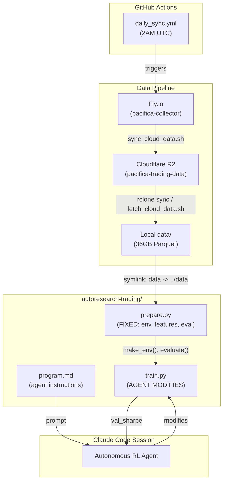
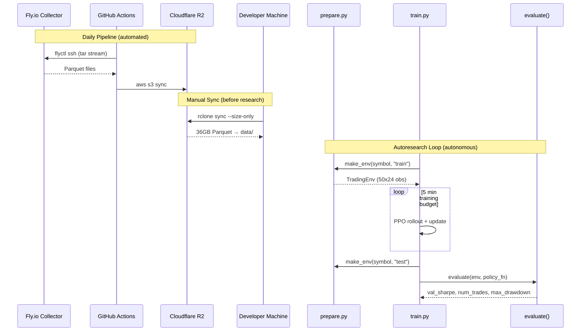

# Codebase Map

> Auto-generated by Cartographer. Last mapped: 2026-03-10

## System Overview



## Directory Structure

```
autoresearch-trading/              # repo root
├── .github/workflows/
│   └── daily_sync.yml             # Fly.io → R2 daily at 2AM UTC
├── autoresearch-trading/          # RL research project (self-contained)
│   ├── .cache/                    # cached .npz feature files (gitignored)
│   ├── data -> ../data            # symlink to repo-level data/
│   ├── .python-version            # 3.12
│   ├── pyproject.toml             # torch, gymnasium, numpy, pandas, pyarrow
│   ├── uv.lock                    # pinned dependencies
│   ├── prepare.py                 # FIXED: data loading, features, TradingEnv, evaluate()
│   ├── train.py                   # MUTABLE: agent rewrites this each experiment
│   └── program.md                 # agent instructions (Karpathy autoresearch pattern)
├── data/                          # 36GB Hive-partitioned Parquet (gitignored)
│   ├── trades/symbol={SYM}/date={DATE}/*.parquet
│   ├── orderbook/symbol={SYM}/date={DATE}/*.parquet
│   └── funding/symbol={SYM}/date={DATE}/*.parquet
├── scripts/
│   ├── sync_cloud_data.sh         # Fly.io → R2 (used by daily_sync workflow)
│   └── fetch_cloud_data.sh        # R2 → local (superseded by rclone)
├── docs/plans/                    # design docs and implementation plans
├── CLAUDE.md                      # repo-level Claude Code instructions
├── README.md                      # project overview
└── .gitignore                     # excludes data/, .cache/, .env, logs
```

## Module Guide

### autoresearch-trading/ (RL Research Project)

**Purpose**: Autonomous RL research for DEX perpetual futures trading
**Entry point**: `uv run train.py`

| File | Purpose | Tokens |
|------|---------|--------|
| `prepare.py` | Data pipeline, feature engineering, TradingEnv, evaluate() | 5,638 |
| `train.py` | CleanRL-style PPO agent (agent modifies this) | 1,776 |
| `program.md` | Autonomous agent instructions and research hints | 3,092 |
| `pyproject.toml` | Dependencies: torch, gymnasium, numpy, pandas, pyarrow | 100 |

**Key exports from prepare.py:**
- `make_env(symbol, split, window_size, trade_batch)` — creates TradingEnv
- `evaluate(env, policy_fn)` — runs policy, returns Sharpe ratio
- `prepare_data(symbols)` — pre-caches features for all symbols/splits
- `TradingEnv` — Gymnasium env, 3 actions (flat/long/short), 24 features
- `DEFAULT_SYMBOLS` — all 25 crypto symbols
- `TRAIN_BUDGET_SECONDS = 300`

**Key exports from train.py:**
- `compute_reward(info, reward_state)` — reward = pnl - vol_penalty - dd_penalty
- `PolicyNetwork(obs_shape)` — MLP with actor/critic heads
- `train()` — PPO training loop + evaluation

### scripts/ (Data Sync)

**Purpose**: Move data between Fly.io, Cloudflare R2, and local disk

| File | Purpose | Tokens |
|------|---------|--------|
| `sync_cloud_data.sh` | Fly.io → R2 via streaming tar + aws s3 sync | 806 |
| `fetch_cloud_data.sh` | R2 → local via aws s3 sync | 283 |

### .github/workflows/ (CI/CD)

| File | Purpose | Tokens |
|------|---------|--------|
| `daily_sync.yml` | Runs sync_cloud_data.sh daily at 2AM UTC | 226 |

### docs/plans/ (Design Documents)

| File | Purpose | Tokens |
|------|---------|--------|
| `2026-03-09-autoresearch-trading-design.md` | Architecture design | 923 |
| `2026-03-09-autoresearch-trading-plan.md` | Implementation plan (7 tasks) | 5,003 |
| `2026-03-09-rl-research-findings.md` | RL state-of-the-art research | 1,312 |
| `2026-03-10-repo-cleanup.md` | Repo cleanup plan (11 tasks) | 2,900 |

## Data Flow



## Conventions

- **Karpathy autoresearch pattern**: `prepare.py` (fixed) + `train.py` (agent modifies) + `program.md` (human iterates)
- **Commit style**: Conventional commits (`feat:`, `fix:`, `chore:`, `experiment:`)
- **Git safety**: Only stage `autoresearch-trading/` paths, never `git add -A`
- **Experiment tracking**: `results.tsv` with columns: commit, val_sharpe, num_trades, max_drawdown, status, description
- **Output format**: Greppable `key: value` lines for machine parsing

## Gotchas

1. **R2 fake timestamps**: R2 returns 1999-12-31 for all file timestamps. Use `--size-only` with rclone/aws s3 sync to avoid re-downloading everything.

2. **`val_sharpe` uses test split**: Despite the name, `evaluate()` runs on the test split (2026-02-17 to 2026-03-09), not validation. The naming is intentional but confusing.

3. **Data symlink**: `autoresearch-trading/data -> ../data` must exist. `prepare.py` resolves `DATA_ROOT` relative to its own `__file__` location.

4. **Cache invalidation**: Feature cache keys on `(symbol, start, end, trade_batch)`. Changing `trade_batch` in `train.py` triggers recompute. Changing feature engineering requires manual `.cache/` deletion.

5. **Fee model**: Switching positions (long→short) pays 2x fees (close + open). Flat→long pays 1x.

6. **MPS quirks**: Some PyTorch ops fail on Apple Silicon MPS. Fall back to CPU for unsupported ops.

7. **`fetch_cloud_data.sh` is superseded**: Uses `aws s3 sync` with modtime comparison (broken on R2). Use `rclone sync ... --size-only` instead.

## Navigation Guide

**To start an autoresearch session**: `cd autoresearch-trading && claude --dangerously-skip-permissions -p "$(cat program.md)"`

**To sync data from R2**: `rclone sync r2:pacifica-trading-data ./data/ --transfers 32 --checkers 64 --size-only`

**To modify the RL agent**: Edit `autoresearch-trading/train.py` only

**To change features or environment**: You can't — `prepare.py` is fixed by design

**To add a new symbol**: Add to `DEFAULT_SYMBOLS` in `prepare.py` and re-cache

**To clear feature cache**: `rm -rf autoresearch-trading/.cache/`
