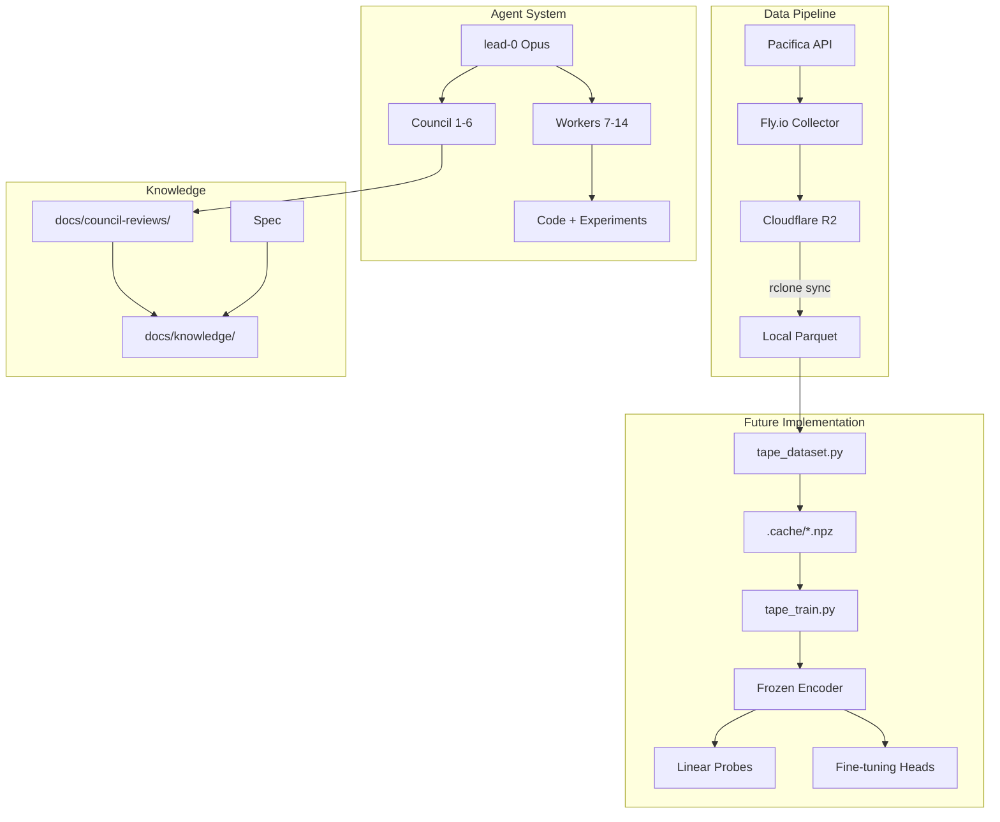
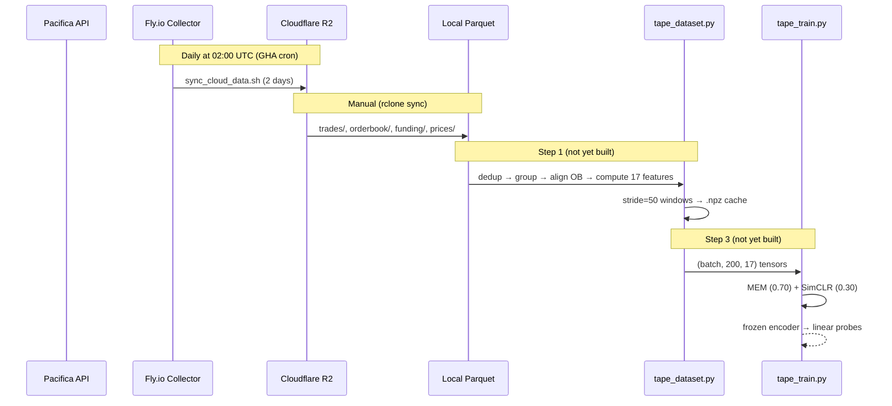

# Codebase Map

> Auto-generated by Cartographer. Last mapped: 2026-04-11

## System Overview

DEX perpetual futures tape representation learning. Self-supervised encoder trained on 40GB of raw order event data (160 days, 25 crypto symbols) to learn meaningful tape representations. Direction prediction is a downstream probing task, not the objective.

**Status:** Spec complete, council reviewed (Round 5), no implementation code yet. Next: Step 0 (data validation) then Step 2 (baselines/Gate 0).



## Directory Structure

```
autoresearch-trading/
├── CLAUDE.md                          # Working context for all agents
├── README.md                          # Project overview (needs update)
├── pyproject.toml                     # Python 3.12+, PyTorch, DuckDB deps
├── .env                               # R2 credentials (gitignored)
├── .python-version                    # 3.12.x
├── .gitignore
│
├── .claude/
│   ├── agents/                        # 15 agent definitions
│   │   ├── lead-0.md                  # Opus orchestrator
│   │   ├── council-{1-6}.md           # Advisory council (read-only)
│   │   └── {runpod-7..researcher-14}.md  # Worker agents
│   ├── skills/                        # 5 project skills
│   │   ├── autoresearch/              # Experiment loop protocol
│   │   ├── compile-knowledge/         # Wiki distillation
│   │   ├── experiment-eval/           # Pre-registered eval criteria
│   │   ├── health-check/              # Consistency audit
│   │   └── research-first/            # Prior-art check
│   └── settings.local.json            # Local Claude config
│
├── scripts/
│   ├── fetch_cloud_data.sh            # Generic S3/R2 sync (legacy)
│   └── sync_cloud_data.sh            # Fly.io → R2 daily sync
│
├── .github/workflows/
│   └── daily_sync.yml                 # 02:00 UTC cron → sync_cloud_data.sh
│
├── data/                              # 40GB raw parquet (gitignored)
│   ├── trades/symbol={SYM}/date={DATE}/
│   ├── orderbook/symbol={SYM}/date={DATE}/
│   ├── funding/symbol={SYM}/date={DATE}/
│   └── prices/symbol={SYM}/date={DATE}/   # Apr 1+ only
│
├── docs/
│   ├── superpowers/specs/
│   │   └── 2026-04-10-tape-representation-learning-spec.md  # Master spec
│   ├── knowledge/                     # Compiled wiki
│   │   ├── INDEX.md                   # Article index
│   │   ├── concepts/                  # 11 articles (features, methods)
│   │   ├── decisions/                 # 10 ADRs (architectural choices)
│   │   └── experiments/               # 2 articles (v11 baseline)
│   ├── council-reviews/               # Active reviews
│   │   ├── repr-learning-synthesis.md # Initial pivot synthesis
│   │   └── 2026-04-10-round5-*.md    # Round 5 (6 reviews + synthesis)
│   ├── research/                      # Literature surveys
│   │   ├── 2026-04-10-*-*.md         # 3 studies + synthesis
│   └── archive/                       # Historical artifacts (~390K tokens)
│       ├── old-council-reviews/       # Rounds 1-4
│       ├── old-experiments/           # Supervised MLP experiments
│       ├── old-plans/                 # Prior implementation plans
│       ├── old-specs/                 # Prior spec versions
│       ├── old-research/              # Prior research
│       └── proofs/                    # Lean 4 / Aristotle theorems
│
└── .cache/                            # Preprocessed .npz (gitignored)
```

## Agent System

```
claude --agent lead-0  (opus)
│
├── COUNCIL (parallel, read-only, write to docs/council-reviews/)
│   ├── council-1  Lopez de Prado    eval methodology, multiple testing, CPCV
│   ├── council-2  Rama Cont         OFI, LOB microstructure, spread dynamics
│   ├── council-3  Albert Kyle       kyle_lambda, informed trading, price impact
│   ├── council-4  Richard Wyckoff   PRIMARY VOICE — tape states, effort/result
│   ├── council-5  Practitioner      SKEPTIC — falsifiability, overfitting, rigor
│   └── council-6  DL Researcher     PRIMARY ARCHITECT — MEM, SimCLR, CNN design
│
└── WORKERS (sequential, write code/reports)
    ├── runpod-7    RunPod Operator   GPU lifecycle, SSH, Chrome MCP
    ├── builder-8   Builder           writes tape_dataset.py, tape_train.py
    ├── analyst-9   Analyst           statistics, cluster analysis, DuckDB
    ├── reviewer-10 Reviewer          code review gate (read-only)
    ├── validator-11 Validator        binary PASS/FAIL evaluation gates
    ├── prover-12   Prover            Lean 4 theorem formalization
    ├── data-eng-13 Data Engineer     parquet → tensor pipeline
    └── researcher-14 Researcher     web research via Exa MCP
```

## Module Guide

### Spec (`docs/superpowers/specs/`)

| File | Purpose | Tokens |
|------|---------|--------|
| `2026-04-10-tape-representation-learning-spec.md` | Master specification: 17 features, architecture, pretraining, 5 gates | 5,578 |

### Knowledge Base (`docs/knowledge/`)

**Concepts** (11 articles, 9,597 tokens):

| File | Topic |
|------|-------|
| `effort-vs-result.md` | Feature 7 — Wyckoff absorption master signal |
| `climax-score.md` | Feature 8 — phase transition markers |
| `kyle-lambda.md` | Feature 16 — information regime indicator |
| `cum-ofi.md` | Feature 17 — piecewise Cont 2014 order flow imbalance |
| `book-walk.md` | Feature 6 — spread-normalized order aggressiveness |
| `order-event-grouping.md` | Same-timestamp trade dedup and grouping |
| `orderbook-alignment.md` | searchsorted OB snapshot pairing |
| `mem-pretraining.md` | MEM objective: block masking, BN order, loss annealing |
| `contrastive-learning.md` | SimCLR NT-Xent: augmentation, temperature, collapse |
| `self-labels.md` | Computable Wyckoff labels for probes/contrastive |
| `gate0-baseline.md` | PCA + logistic regression reference methodology |

**Decisions** (10 ADRs, 5,137 tokens):

| File | Decision |
|------|----------|
| `pivot-to-representation-learning.md` | Why: supervised MLP hit ceiling |
| `drop-is-buy.md` | Why: half-life=1, 59% ambiguity, distributional break |
| `ob-cadence-24s.md` | Measured 24s not 3s — cascading impact on 3 features |
| `per-snapshot-kyle-lambda.md` | Per-event had ~2 effective observations |
| `cum-ofi-5-not-20.md` | 5 snapshots (~120s) matches prediction horizon |
| `mem-block-size-20.md` | 5-event blocks trivially solvable by layer-1 conv |
| `ntxent-temperature.md` | τ=0.5→0.3 annealing (not ImageNet 0.1) |
| `notional-not-raw-qty.md` | Cross-symbol comparability requires qty*price |
| `liquid-symbol-subgate.md` | Prevents gaming Gate 1 with low-volume symbols |
| `april-holdout-window.md` | Apr 14+ untouched; Mar data contaminated |

### Council Reviews (`docs/council-reviews/`)

| File | Content |
|------|---------|
| `repr-learning-synthesis.md` | Initial pivot review synthesis (4 members) |
| `2026-04-10-round5-synthesis.md` | Round 5 synthesis: 4 blocking, 6 high-priority |
| `round5-council-1-*.md` | Gate 0 methodology, statistical power |
| `round5-council-2-*.md` | OB feature implementation correctness |
| `round5-council-3-*.md` | Kyle lambda, information regimes |
| `round5-council-4-*.md` | Self-label calibration, firing rates |
| `round5-council-5-*.md` | Implementation risks, silent corruptions |
| `round5-council-6-*.md` | Pretraining mechanics, BN order, loss annealing |

### Research (`docs/research/`)

| File | Topic |
|------|-------|
| `2026-04-10-masked-pretraining-time-series.md` | Block masking strategies, augmentation noise |
| `2026-04-10-self-supervised-financial-data.md` | LOBERT, NT-Xent temperature for finance |
| `2026-04-10-embedding-collapse-prevention.md` | RankMe, VICReg variance term |
| `2026-04-10-research-synthesis.md` | Actionable additions beyond council |

## Data Flow



## Conventions

- **Commit style**: `feat:`, `fix:`, `chore:`, `experiment:`, `spec:`, `analysis:`
- **Git safety**: Only stage specific files, never `git add -A`
- **Agent protocol**: Council dispatched in parallel (background), workers sequentially (blocking)
- **Agent output**: Verbose to files, 1-2 sentence summary returned to lead-0
- **Knowledge base**: Concepts (stable reference), Decisions (ADRs with rationale), Experiments (hypothesis/result)

## Gotchas

1. **No implementation code exists yet** — `tape_dataset.py` and `tape_train.py` are to be created
2. **pyproject.toml references old modules** — registers `prepare` and `train` which were removed
3. **Knowledge base may diverge from spec** — Round 5 updates (block size 20, τ=0.5→0.3) are in knowledge base but spec still shows some pre-Round-5 values
4. **Archive is 390K+ tokens** — don't read unless investigating specific historical decisions
5. **README.md describes the old supervised MLP** — needs full rewrite for representation learning

## Navigation Guide

**To understand the project**: Read `CLAUDE.md` (comprehensive working context)
**To check a feature definition**: `docs/knowledge/concepts/<feature>.md`
**To understand a design choice**: `docs/knowledge/decisions/<topic>.md`
**To review council feedback**: `docs/council-reviews/2026-04-10-round5-synthesis.md`
**To start implementation**: Read spec, then `claude --agent lead-0`
**To sync data**: `rclone sync r2:pacifica-trading-data ./data/ --transfers 32 --checkers 64 --size-only`
**To run experiments**: Use the `autoresearch` skill via lead-0
