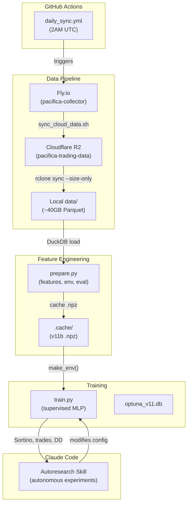
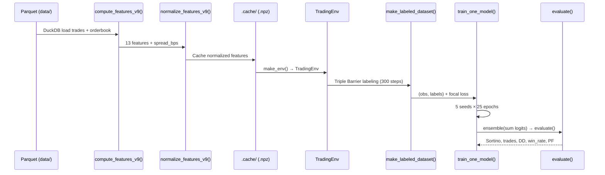

# Codebase Map

> Auto-generated by Cartographer. Last mapped: 2026-03-30

## System Overview



## Directory Structure

```
autoresearch-trading/
├── prepare.py                 — Data loading, 13-feature v11b engineering, TradingEnv, evaluate()
├── train.py                   — DirectionClassifier MLP, focal loss training, Optuna search
├── tests/                     — ~98 tests across 10 files
│   ├── conftest.py            — Shared fixtures (synthetic trades/orderbook/funding)
│   ├── test_features.py       — Legacy 39-feature path tests (~45 tests)
│   ├── test_features_v9.py    — Active v9 feature pipeline tests (14 tests)
│   ├── test_features_v11.py   — v11 additions tests (5 tests, asserts shape[1]==13)
│   ├── test_normalization.py  — Hybrid normalization tests (7 tests)
│   ├── test_env.py            — TradingEnv min_hold constraint tests (8 tests)
│   ├── test_funding_cost.py   — Funding rate integration tests (6 tests)
│   ├── test_metrics.py        — Sortino/Sharpe/Calmar/CVaR formula tests (6 tests)
│   ├── test_model_v9.py       — HybridClassifier tests (3 tests, inactive model)
│   └── test_regime_gate.py    — Hawkes/VPIN gate logic tests (3 tests)
├── scripts/
│   ├── sync_cloud_data.sh     — Fly.io → R2 via streaming tar + aws s3 sync
│   ├── fetch_cloud_data.sh    — R2 → local via aws s3 sync
│   ├── walk_forward.py        — 4-fold rolling walk-forward validation
│   ├── ablate_features.py     — Feature importance by zeroing (v11 ablation)
│   ├── analyze_signal_autocorrelation.py — T47: ACF/cross-correlation for window sizing
│   ├── analyze_sortino_variance.py      — T46: bootstrap Sortino variance analysis
│   ├── analyze_funding.py               — T42: funding rate cost analysis
│   ├── analyze_conditional_spread.py    — T43: conditional spread widening test
│   ├── analyze_correlation.py           — T44: cross-symbol return correlation
│   ├── analyze_spreads.py               — T40: per-symbol spread/tradeability analysis
│   └── sim_maker_execution.py           — T41: maker-fee simulation upper bound
├── data/                      — ~40GB Hive-partitioned Parquet (gitignored)
│   ├── trades/symbol={SYM}/date={DATE}/*.parquet
│   ├── orderbook/symbol={SYM}/date={DATE}/*.parquet
│   └── funding/symbol={SYM}/date={DATE}/*.parquet
├── .cache/                    — Cached v11b .npz feature files (gitignored)
├── .claude/skills/autoresearch/
│   ├── SKILL.md               — Autonomous research loop protocol
│   └── resources/
│       ├── parse_summary.sh   — Extract PORTFOLIO SUMMARY metrics
│       └── state.md           — Current research state
├── docs/
│   ├── experiments/           — Experiment plans, reports, results
│   ├── superpowers/specs/     — Architecture design specs
│   ├── superpowers/plans/     — Implementation plans
│   ├── plans/                 — Legacy plans (mostly obsolete)
│   └── research/              — Research docs (cross-asset, labeling, portfolio)
├── proofs/                    — Aristotle Lean 4 proofs (T0-T47)
├── .github/workflows/
│   └── daily_sync.yml         — Daily Fly.io → R2 sync at 2AM UTC
├── results.tsv                — Experiment tracking history
├── pyproject.toml             — Dependencies: torch, gymnasium, numpy, pandas, duckdb, optuna
└── .python-version            — 3.12
```

## Module Guide

### prepare.py — Data Pipeline + Environment

**Purpose**: Loads Hive-partitioned Parquet via DuckDB, computes 13 microstructure features per 100-trade batch, normalizes with rolling z-score/IQR, wraps in Gymnasium TradingEnv, and provides `evaluate()` for Sortino-based scoring.

| Export | Description |
|--------|-------------|
| `compute_features_v9()` | **Active** 13-feature pipeline → `(features, timestamps, prices, raw_hawkes, spread_bps)` |
| `normalize_features_v9()` | Rolling z-score (window=1000), IQR for robust cols `{4,5,11}`, clipped ±5 |
| `TradingEnv` | Gymnasium env: obs=(window, 13), actions={flat, long, short}, fee+slippage model |
| `evaluate()` | Full-test Sortino with trade-level metrics (win_rate, profit_factor, avg_hold) |
| `make_env()` | Factory: loads/caches features, constructs TradingEnv |
| `compute_features()` | Legacy 39-feature pipeline (inactive, `USE_V9=True` bypasses) |
| `DEFAULT_SYMBOLS` | 25 symbols; 2 excluded at runtime (CRV, XPL — wide spreads) |

**Active 13 features (v11b):**

| # | Feature | Source |
|---|---------|--------|
| 0 | lambda_ofi | trade+orderbook |
| 1 | directional_conviction | trade |
| 2 | vpin | trade |
| 3 | hawkes_branching | trade |
| 4 | reservation_price_dev | orderbook (robust) |
| 5 | vol_of_vol | trade (robust) |
| 6 | utc_hour_linear | time |
| 7 | microprice_dev | orderbook |
| 8 | delta_tfi | trade |
| 9 | multi_level_ofi | orderbook |
| 10 | buy_vwap_dev | trade |
| 11 | trade_arrival_rate | trade (robust) |
| 12 | r_20 | trade |

### train.py — Model + Training

**Purpose**: Defines `DirectionClassifier` (flat MLP), Triple Barrier labeling, focal-loss training with class/recency weighting, and Optuna hyperparameter search.

| Export | Description |
|--------|-------------|
| `DirectionClassifier` | **Active model**: flatten(obs) + mean + std → 676 → 64 → 64 → 64 → 3, ~52K params |
| `HybridClassifier` | Inactive: flat MLP + 1D TCN hybrid |
| `make_labeled_dataset()` | Triple Barrier: scan 300 steps forward, cost-adjusted thresholds |
| `train_one_model()` | Focal loss (γ=1) + class weights + recency weights, 25 epochs |
| `full_run()` | Train 5 seeds, ensemble (sum logits → argmax), evaluate |
| `BEST_PARAMS` | Current optimal config (all 16 hyperparameters swept) |
| `EXCLUDED_SYMBOLS` | `{"CRV", "XPL"}` — filtered from tradeable universe |

### scripts/ — Analysis + Data Sync

| Script | Purpose | Theorem |
|--------|---------|---------|
| `walk_forward.py` | 4-fold rolling validation (80d/20d/20d) | — |
| `ablate_features.py` | Feature importance by zeroing at test time | — |
| `analyze_signal_autocorrelation.py` | ACF/cross-correlation for window sizing | T47 |
| `analyze_sortino_variance.py` | Bootstrap Sortino variance analysis | T46 |
| `analyze_funding.py` | Funding rate cost vs fee barrier | T42 |
| `analyze_conditional_spread.py` | Spread widening under high activity | T43 |
| `analyze_correlation.py` | Cross-symbol return correlation | T44 |
| `analyze_spreads.py` | Per-symbol spread/tradeability classification | T40 |
| `sim_maker_execution.py` | Maker-fee simulation upper bound | T41 |
| `sync_cloud_data.sh` | Fly.io → R2 daily sync | — |
| `fetch_cloud_data.sh` | R2 → local bootstrap sync | — |

## Data Flow



## Experiment History

### Completed with Results

| Date | Experiment | Result |
|------|-----------|--------|
| 2026-03-25 | fee_mult sweep {8,9,10,11,12.9,15} | **fee_mult=11.0 wins** |
| 2026-03-28 | window sweep {10,20,50} | **window=50 wins** (T47 falsified) |

### Research Documents

| Document | Topic | Key Finding |
|----------|-------|-------------|
| `cross-asset-microstructure-features.md` | Cross-asset signals | BTC lag-1 return is strongest cross-asset predictor |
| `labeling-methods-research.md` | Advanced labeling | Metalabeling highest priority (acc 17%→63% OOS) |
| `portfolio-construction-sizing.md` | Portfolio construction | BTC regime switch + dynamic symbol selection are immediate wins |
| `research-architectures-beyond-mlp.md` | Architecture alternatives | ResNet skip connections and 10-seed ensemble highest probability |
| `research-training-methodology-noisy-labels.md` | Training methods | GCE loss (q=0.7) and Mean Teacher/EMA are top picks |

### Design Specs Status

| Spec | Designed | Implemented? |
|------|----------|-------------|
| Verification module | XGBoost baseline comparison | Yes |
| 2D attention architecture | H100 Flash Attention | No (v7 failed: 0.061 Sortino) |
| Ablation agent | Feature isolation skill | Yes |
| Tape reading pivot | 8 tape features (v6) | Yes (regressed) |
| Experiment skill | Autoresearch loop | Yes |
| Orderbook edge hybrid | 7 OB features + TCN (v8) | Yes (regressed) |
| Aristotle-proven v9 | 5 proven features | Yes |
| Realism T42-T45 | Funding, slippage, correlation, latency | Yes |
| Walk-forward T46-T47 | Variance bound, optimal window | Yes |

## Conventions

- **Commit style**: `feat:`, `fix:`, `chore:`, `experiment:`, `spec:`, `plan:`
- **Git safety**: Only stage specific files, never `git add -A`
- **Experiment tracking**: `results.tsv` (commit, sortino, trades, dd, passing, status, description)
- **Output format**: Greppable `key: value` lines in PORTFOLIO SUMMARY
- **Autoresearch pattern**: One variable per experiment, always include control run

## Gotchas

1. **R2 fake timestamps**: Use `--size-only` with rclone — R2 returns 1999-12-31 for all timestamps.
2. **Cache invalidation**: `_FEATURE_VERSION = "v11b"` — bump to invalidate. Changing features without bumping reuses stale cache silently.
3. **Fee model**: Switching positions (long→short) pays 2× fees (close + open). Slippage = half_spread + 3bps impact per leg.
4. **`evaluate()` uses test split**: Despite being called during training, it runs on test data (2026-02-17 to 2026-03-25).
5. **`stable-baselines3` in pyproject.toml**: Historical artifact from RL era — not used by current supervised approach.
6. **EXCLUDED_SYMBOLS**: CRV and XPL filtered at runtime (wide spreads) — 25 symbols defined, 23 tradeable.
7. **Legacy code paths**: `compute_features()` (39 features), `normalize_features()`, `HybridClassifier` all exist but are inactive (`USE_V9=True`, `DirectionClassifier` hardcoded).

## Navigation Guide

**To start an autoresearch session**: Ask Claude to "run experiments" or "improve the model"

**To sync data from R2**: `rclone sync r2:pacifica-trading-data ./data/ --transfers 32 --checkers 64 --size-only`

**To run walk-forward validation**: `uv run scripts/walk_forward.py`

**To run the model**: `uv run train.py` (uses BEST_PARAMS) or `uv run train.py --search` (Optuna)

**To run tests**: `uv run pytest tests/`

**To add a new feature**: Add to `compute_features_v9()`, update `V9_FEATURE_NAMES`, bump `V9_NUM_FEATURES`, update `V9_ROBUST_FEATURE_INDICES` if needed, bump `_FEATURE_VERSION`

**To clear feature cache**: `rm -rf .cache/`
