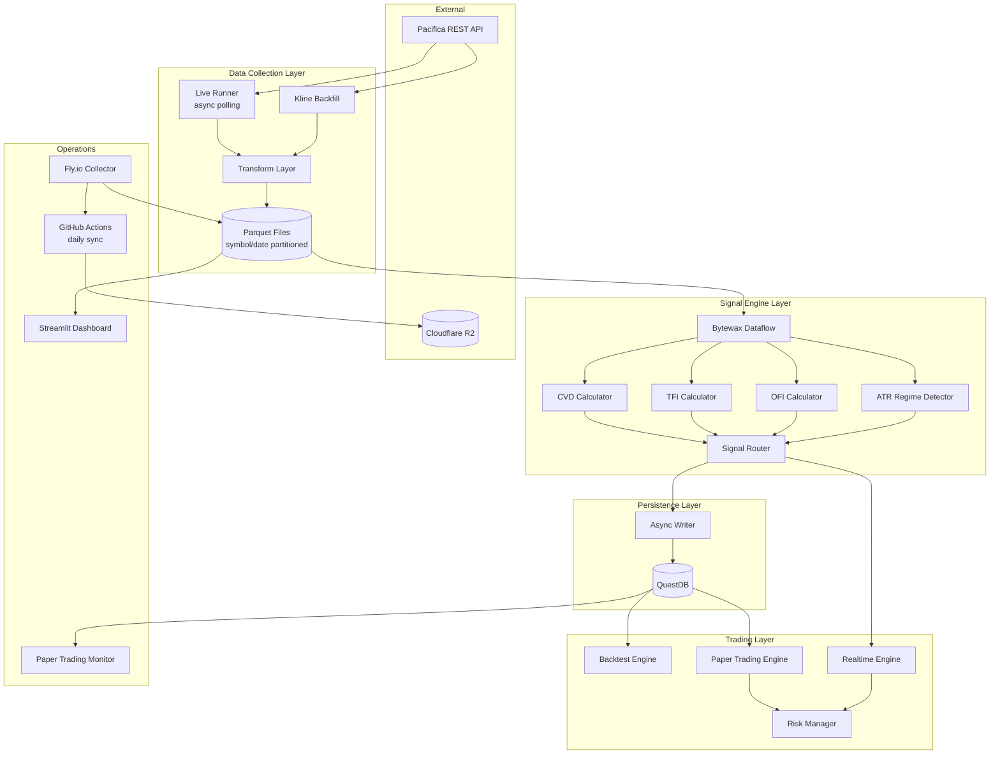
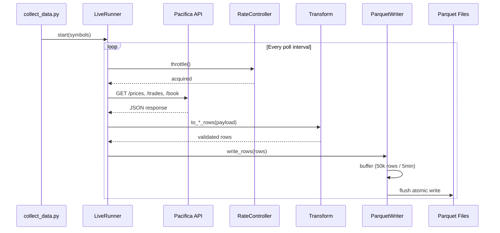
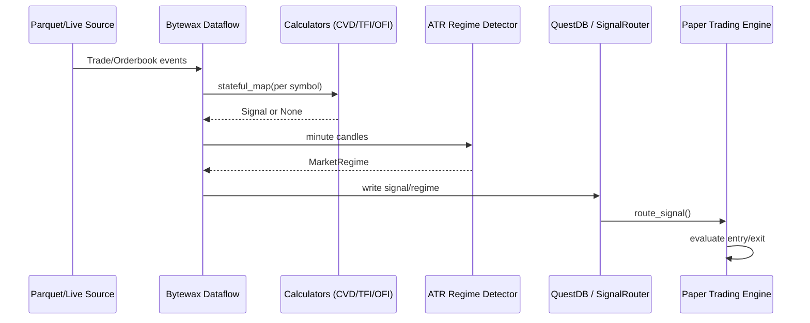

# Codebase Map

> Auto-generated by Cartographer. Last mapped: 2026-01-25

## System Overview

This is a **neurosymbolic trading bot for DEX perpetuals** combining tape-reading signals (CVD, TFI, OFI) with regime detection and hierarchical decision-making. The system spans data collection, real-time signal processing, backtesting, and paper trading.



## Directory Structure

```
data-collector/
├── config/                    # Shared configuration (Pydantic models)
│   ├── __init__.py           # AppSettings facade
│   ├── api.py                # PacificaAPISettings
│   ├── deployment.py         # DeploymentSettings
│   ├── settings.py           # Legacy Settings wrapper
│   ├── signals.py            # SignalSettings (CVD/TFI/OFI thresholds)
│   ├── storage.py            # StorageSettings + QuestDB config
│   └── trading.py            # TradingSettings (risk limits)
│
├── src/collector/            # Data collection package
│   ├── api_client.py         # Generic HTTP client with retries
│   ├── pacifica_rest.py      # Pacifica API facade
│   ├── models.py             # Pydantic data models
│   ├── transform.py          # API response → storage rows
│   ├── storage.py            # Async Parquet writer
│   ├── rate.py               # Async rate limiter
│   ├── live_runner.py        # Continuous polling engine
│   ├── backfill.py           # Historical kline downloader
│   ├── config.py             # Legacy settings adapter
│   └── utils.py              # Time/signal utilities
│
├── signal-engine/src/        # Signal processing package
│   ├── signals/              # Signal calculators
│   │   ├── base.py           # Core models (Signal, Trade, etc.)
│   │   ├── cvd.py            # Cumulative Volume Delta
│   │   ├── tfi.py            # Trade Flow Imbalance
│   │   └── ofi.py            # Order Flow Imbalance
│   ├── stream/               # Bytewax dataflows
│   │   ├── dataflow.py       # Batch signal pipeline
│   │   ├── realtime_dataflow.py  # Live streaming pipeline
│   │   ├── live_sources.py   # API polling sources
│   │   ├── sources.py        # Parquet replay sources
│   │   └── signal_router.py  # In-memory pub/sub
│   ├── backtest/             # Backtesting framework
│   │   ├── engine.py         # Event-driven backtest
│   │   ├── strategy.py       # Signal aggregation
│   │   ├── position_manager.py  # Position sizing/exits
│   │   ├── metrics.py        # Performance statistics
│   │   └── reporter.py       # Console output
│   ├── paper_trading/        # Paper trading system
│   │   ├── engine.py         # Poll-based engine
│   │   ├── realtime_engine.py  # Event-driven engine
│   │   ├── position_tracker.py # Position lifecycle
│   │   ├── risk_manager.py   # Circuit breakers
│   │   └── trade_executor.py # Entry/exit logic
│   ├── db/                   # QuestDB integration
│   │   ├── questdb.py        # Client + Bytewax sinks
│   │   └── schema.sql        # Table definitions
│   ├── regime/               # Market regime detection
│   │   └── detectors.py      # ATR-based classifier
│   ├── live/                 # Live data client
│   │   └── stream_client.py  # Pacifica polling client
│   ├── api/                  # Async API client
│   │   └── live_data.py      # Price fetching
│   ├── persistence/          # Background I/O
│   │   └── async_writer.py   # Batched QuestDB writes
│   └── config/               # Signal-engine settings
│       └── settings.py       # Settings dataclass
│
├── scripts/                  # Operational entry points
│   ├── collect_data.py       # Main CLI (live, backfill, queries)
│   ├── collect_all_symbols.py     # Multi-symbol local wrapper
│   ├── collect_all_symbols_cloud.py  # Cloud production collector
│   ├── sync_cloud_data.sh    # Fly.io → R2 sync
│   ├── fetch_cloud_data.sh   # R2 → local download
│   └── validate_cloud_dataset.py  # Parquet health check
│
├── signal-engine/scripts/    # Signal engine entry points
│   ├── run_signal_pipeline.py     # Backfill signals to QuestDB
│   ├── run_backtest.py            # Historical backtesting
│   ├── run_paper_trading.py       # Poll-based paper trading
│   ├── run_realtime_trading.py    # Event-driven paper trading
│   ├── monitor_paper_trading.py   # Live P&L dashboard
│   ├── test_signals_manual.py     # Signal validation tool
│   └── setup_questdb_local.py     # Schema initializer
│
├── tests/                    # Collector test suite
├── signal-engine/tests/      # Signal engine test suite
│   ├── unit/                 # Fast, mocked tests
│   └── integration/          # QuestDB-dependent tests
│
├── deploy/                   # Deployment configurations
│   ├── fly.toml              # Fly.io (primary)
│   ├── docker-compose.yml    # Local dev stack
│   ├── railway.toml          # Railway (alternative)
│   └── render.yaml           # Render (alternative)
│
├── dashboards/app.py         # Streamlit visualization
├── monitoring/               # Health check scripts
│
├── docs/                     # Documentation
│   ├── vision/               # Strategy & roadmap
│   ├── architecture/         # Design & structure
│   ├── operations/           # Deployment & sync guides
│   └── reports/              # Test validation reports
│
├── Makefile                  # Build automation
├── requirements.txt          # Python dependencies
└── Dockerfile.cloud          # Production container
```

## Module Guide

### Data Collection (`src/collector/`)

**Purpose**: Fetch market data from Pacifica REST API and persist to Parquet files.

**Entry point**: `scripts/collect_data.py`

| File | Purpose | Tokens |
|------|---------|--------|
| `live_runner.py` | Async polling engine with concurrent tasks | 1,777 |
| `transform.py` | Normalize API responses to storage rows | 2,261 |
| `storage.py` | Buffered Parquet writer with partitioning | 708 |
| `api_client.py` | HTTP client with retries and pooling | 662 |
| `pacifica_rest.py` | High-level API wrapper | 519 |
| `backfill.py` | Historical kline downloader | 923 |
| `models.py` | Pydantic data schemas | 386 |
| `rate.py` | Token bucket rate limiter | 224 |

**Key exports**: `LiveRunner`, `ParquetWriter`, `PacificaREST`, `KlineBackfillRunner`

**Dependencies**: `httpx`, `pandas`, `pyarrow`, `aiolimiter`, `structlog`

### Signal Calculators (`signal-engine/src/signals/`)

**Purpose**: Stateful calculators that emit trading signals from market data.

| File | Purpose | Tokens |
|------|---------|--------|
| `base.py` | Core models: Signal, Trade, OrderbookSnapshot, MarketRegime | 668 |
| `cvd.py` | Cumulative Volume Delta with divergence detection | 852 |
| `tfi.py` | Trade Flow Imbalance over rolling time window | 543 |
| `ofi.py` | Order Flow Imbalance using top-of-book deltas | 991 |

**Key exports**: `CVDCalculator`, `TFICalculator`, `OFICalculator`, `Signal`, `SignalDirection`

**Patterns**:
- Stateful calculators with internal deques
- Confidence scaling: CVD ÷ 0.3, TFI ÷ 0.5, OFI ÷ 4.0 (all capped at 1.0)
- CVD requires `lookback_periods` trades before emitting
- TFI uses time-based window (seconds), OFI uses z-score threshold

### Stream Processing (`signal-engine/src/stream/`)

**Purpose**: Bytewax dataflows for batch and real-time signal generation.

| File | Purpose | Tokens |
|------|---------|--------|
| `dataflow.py` | Batch pipeline builder for historical replay | 2,156 |
| `realtime_dataflow.py` | Live streaming pipeline | 827 |
| `live_sources.py` | Bytewax sources polling Pacifica API | 1,265 |
| `sources.py` | Parquet and in-memory replay sources | 1,384 |
| `signal_router.py` | In-memory pub/sub for real-time fan-out | 1,049 |

**Key exports**: `build_signal_dataflow`, `build_realtime_dataflow`, `SignalRouter`

**Dependencies**: `bytewax`

**Patterns**:
- Symbol-keyed state isolation in Bytewax
- Minute candles emitted on minute boundary crossing
- SignalRouter decouples producers from consumers

### Backtesting (`signal-engine/src/backtest/`)

**Purpose**: Event-driven simulation for strategy validation.

| File | Purpose | Tokens |
|------|---------|--------|
| `engine.py` | Chronological event replay with position management | 2,410 |
| `strategy.py` | Signal aggregation for entry decisions | 777 |
| `position_manager.py` | Position sizing, SL/TP, exit logic | 1,058 |
| `metrics.py` | Win rate, profit factor, Sharpe, drawdown | 1,642 |
| `reporter.py` | Rich console output | 578 |

**Key exports**: `BacktestEngine`, `BacktestConfig`, `BacktestResults`, `SignalAggregator`

**Entry point**: `signal-engine/scripts/run_backtest.py`

### Paper Trading (`signal-engine/src/paper_trading/`)

**Purpose**: Simulated trading with real-time signals and risk management.

| File | Purpose | Tokens |
|------|---------|--------|
| `engine.py` | Poll-based engine querying QuestDB | 1,634 |
| `realtime_engine.py` | Event-driven engine via SignalRouter | 1,584 |
| `trade_executor.py` | Entry/exit orchestration | 2,120 |
| `position_tracker.py` | In-memory position lifecycle | 924 |
| `risk_manager.py` | Circuit breakers and limits | 1,352 |

**Key exports**: `PaperTradingEngine`, `RealtimePaperTradingEngine`, `RiskManager`

**Entry points**:
- `signal-engine/scripts/run_paper_trading.py` (poll-based)
- `signal-engine/scripts/run_realtime_trading.py` (event-driven)

### Database (`signal-engine/src/db/`)

**Purpose**: QuestDB integration for signal persistence and querying.

| File | Purpose | Tokens |
|------|---------|--------|
| `questdb.py` | Client with Bytewax sinks | 3,177 |
| `schema.sql` | Table definitions | 422 |

**Tables**: `signals`, `trades_processed`, `orderbook_snapshots`, `paper_trades`, `regime_log`

**Key exports**: `QuestDBClient`, `QuestDBSink`

### Regime Detection (`signal-engine/src/regime/`)

**Purpose**: ATR-based market regime classification.

| File | Purpose | Tokens |
|------|---------|--------|
| `detectors.py` | ATR volatility + liquidity + funding classifier | 950 |

**Regime states**: `LOW_VOL_TRENDING` (tradeable), `HIGH_VOL`, `LOW_LIQUIDITY`, `RISK_OFF`

**Key exports**: `ATRRegimeDetector`

**Dependencies**: `talib`

## Data Flow

### Live Collection Flow



### Signal Pipeline Flow



## Conventions

### Code Style
- **Python**: 3.12+ (tested on 3.13), PEP 8 compliant
- **Formatting**: Black (88 chars), isort (Black profile)
- **Type hints**: Required for public APIs
- **Naming**: snake_case (modules/functions), CapWords (classes)
- **Logging**: `structlog` for structured JSON logs

### Configuration
- **Source**: `.env` file → Pydantic settings
- **Validation**: Field validators with bounds (e.g., `ge=1.0, le=10.0`)
- **Hierarchy**: `.env` → `pydantic_settings` → `AppSettings` → legacy `Settings`

### Testing
- **Unit tests**: Fast, mocked, in `tests/` and `signal-engine/tests/unit/`
- **Integration tests**: QuestDB-dependent, in `signal-engine/tests/integration/`
- **Fixtures**: Shared in `tests/fixtures/` and `signal-engine/tests/fixtures/`
- **Commands**: `make test`, `pytest -m unit`, `pytest -m integration`

## Gotchas

1. **Symbol case sensitivity**: Always uppercase. `position_tracker`, `risk_manager`, `live_sources` all normalize.

2. **Timestamp handling**: All UTC. QuestDB stores as TIMESTAMP. Watch for naive datetimes.

3. **CVD lookback**: Requires `lookback_periods` trades before emitting signals. Inactive on sparse data.

4. **Signal freshness**: `PaperTradingEngine` discards signals older than 60 seconds by default.

5. **Regime gating**: Only `LOW_VOL_TRENDING` allows trading. Adjust thresholds if too restrictive.

6. **Queue overflow**: `SignalRouter` (10k) and `async_writer` (100k) drop items when full.

7. **COPY vs INSERT**: QuestDBClient falls back to INSERT if COPY fails. Performance degrades.

8. **Bytewax state isolation**: Calculators keyed by symbol. Shared state across symbols breaks isolation.

9. **Minute candle emission**: Candles emit when new minute arrives, not per trade. Sparse trading delays regime.

10. **Capital locking**: Backtest allocates capital at entry, returns at exit. Don't reuse for overlapping positions.

## Navigation Guide

**To add a new signal calculator**:
1. Create `signal-engine/src/signals/new_signal.py` with calculator class
2. Export from `signal-engine/src/signals/__init__.py`
3. Add branch in `stream/dataflow.py:build_signal_dataflow()`
4. Add tests in `signal-engine/tests/unit/test_new_signal.py`
5. Add config in `config/signals.py`

**To add a new data type**:
1. Add Pydantic model in `src/collector/models.py`
2. Add transform function in `src/collector/transform.py`
3. Add polling task in `src/collector/live_runner.py`
4. Add tests in `tests/test_transform.py`

**To modify deployment**:
1. Update `deploy/fly.toml` for Fly.io
2. Update `Dockerfile.cloud` for container changes
3. Update `scripts/collect_all_symbols_cloud.py` for collector logic
4. Test with `flyctl deploy --local-only`

**To run backtests**:
```bash
# Start QuestDB
make docker-up

# Backfill signals from Parquet
python signal-engine/scripts/run_signal_pipeline.py --symbols BTC ETH

# Run backtest
python signal-engine/scripts/run_backtest.py --symbols BTC --days 7
```

**To start paper trading**:
```bash
# Poll-based (queries QuestDB)
python signal-engine/scripts/run_paper_trading.py --symbols BTC --execute

# Event-driven (via SignalRouter)
python signal-engine/scripts/run_realtime_trading.py --symbols BTC --execute
```

---

*If cartographer helped you, consider starring: https://github.com/kingbootoshi/cartographer - please!*
